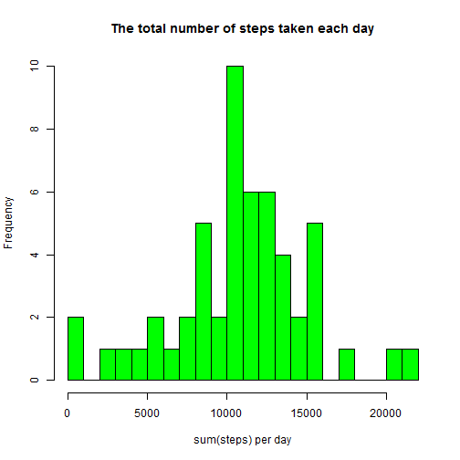
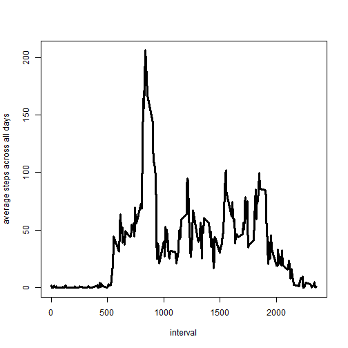
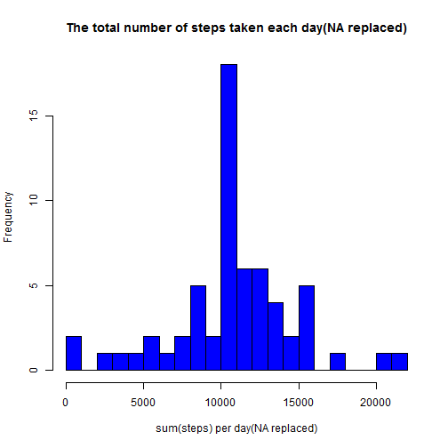
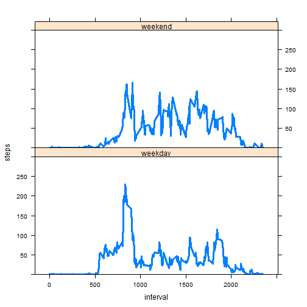

# Reproducible Research: Peer Assessment 1  

## Loading and preprocessing the data
- Make sure that the file "activity.csv" is in your working directory.
- Transfer the date col into type "Date".

```r
data0 <- read.csv("activity.csv")
data0$date <- as.Date(data0$date)
```

## What is mean total number of steps taken per day?
Get rid of the records with "NA" in the "steps" col.

```r
data<-data0[!is.na(data0$steps),]
library(reshape2)
datamelt<-melt(data,id="date",measure.vars="steps")
sumsteps<-dcast(datamelt,date~variable,sum)
hist(sumsteps$steps,breaks=20,col="green",
     main="The total number of steps taken each day",
     xlab="sum(steps) per day")
```

 

```r
meanstep<-mean(sumsteps$steps)
medianstep<-median(sumsteps$steps)
```
The **mean** and **median** total number of steps taken per day are
1.0766 &times; 10<sup>4</sup> and 10765 respectively.  

## What is the average daily activity pattern?

```r
datamelt2<-melt(data,id="interval",measure.vars="steps")
avgsteps<-dcast(datamelt2,interval~variable,mean)
with(avgsteps,plot(interval,steps,type="l",lwd=3,
                   ylab="average steps across all days"))
```

 

```r
nth <- which(avgsteps$steps==max(avgsteps$steps))
numinterval <-  avgsteps$interval[nth]
```
The **104th** 5-minute interval(**value=835**), on average 
across all the days in the dataset, contains the maximum number of steps.  

## Imputing missing values


```r
naindex<-which(is.na(data0$steps))
intervalna<-data0$interval[naindex]
data1<-data0
df1<-data.frame(naid=naindex,interval=intervalna)
vr<-merge(df1,avgsteps,all.x=TRUE)
vr<-vr[order(vr$naid),]
data1$steps[naindex] <- vr$steps
datamelt1<-melt(data1,id="date",measure.vars="steps")
sumsteps1<-dcast(datamelt1,date~variable,sum)
hist(sumsteps1$steps,breaks=20,col="blue",
     main="The total number of steps taken each day(NA replaced)",
     xlab="sum(steps) per day(NA replaced)")
```

 

```r
meanstep1<-mean(sumsteps1$steps)
medianstep1<-median(sumsteps1$steps)
```
In the new data, **NA is replaced with the mean for that 5-minute interval**,the **mean** and **median** total number of steps taken per day change into 1.0766 &times; 10<sup>4</sup> and 1.0766 &times; 10<sup>4</sup> respectively.  
**NOTE:** the origianl table contains two kind of days: one is with all the
records of "steps"; another one with no records at all. If the "NA"s are 
replaced by the avarage value of the interval across all the days, the "mean"
value shouldn't be changed and the "median" could.

## Are there differences in activity patterns between weekdays and weekends?

```r
indwe<- (weekdays(data1$date) %in% c('Saturday','Sunday'))
data2<-data1
data2$WDWE[indwe]<- "weekend"
data2$WDWE[!indwe]<- "weekday"
data2$WDWE<- factor(data2$WDWE)
datamelt2<-melt(data2,id=c("interval","WDWE"),measure.vars="steps")
avgsteps2<-dcast(datamelt2,interval+WDWE~variable,mean)
library(lattice)
xyplot(steps ~ interval | WDWE, data = avgsteps2,
       ylim=c(0,100,200,300),type="l",lwd=3,
       layout=c(1,2))
```

 
